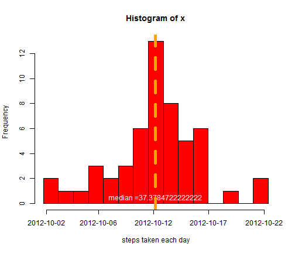
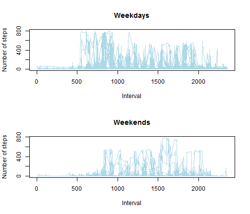
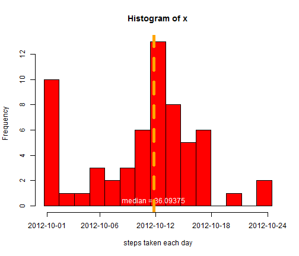

# Reproducible Research: Peer Assessment 1
========================================================
This assignment makes use of data from a personal activity monitoring device. This device collects data at 5 minute intervals through out the day. The data consists of two months of data from an anonymous individual collected during the months of October and November, 2012 and include the number of steps taken in 5 minute intervals each day.


## Loading and preprocessing the data


```r
rm(list = ls())  #clear all variables
data <- read.csv("activity.csv", sep = ",", header = TRUE)
```


## What is mean total number of steps taken per day?


```r
# compute the mean across all steps per day
x <- tapply(data$steps[complete.cases(data$steps)], data$date[complete.cases(data)], 
    mean, na.rm = TRUE)
```


**histogram of the total number of steps taken each day
You can also embed plots, for example:!**


```r
x <- x[complete.cases(x)]
partx <- max(x)/4
p <- as.integer(length(x)/10)
me <- median(x)
t <- paste("median ", me, sep = "=")
r <- hist(x, breaks = 20, xlab = "steps taken each day", xaxt = "n", col = "red")
text(me, r$density[length(r$mids)/2], t, adj = c(0.5, -0.5), col = "white")
abline(v = me, lwd = 5, col = "orange", lty = "dashed")
axis(1, at = c(1, partx, partx * 2, partx * 3, partx * 4), labels = c(names(x[1]), 
    names(x[p]), names(x[2 * p]), names(x[3 * p]), names(x[4 * p])))
```

 


**Print average mean per day!**


```r
write.table(x)
```

```
## "x"
## "2012-10-02" 0.4375
## "2012-10-03" 39.4166666666667
## "2012-10-04" 42.0694444444444
## "2012-10-05" 46.1597222222222
## "2012-10-06" 53.5416666666667
## "2012-10-07" 38.2465277777778
## "2012-10-09" 44.4826388888889
## "2012-10-10" 34.375
## "2012-10-11" 35.7777777777778
## "2012-10-12" 60.3541666666667
## "2012-10-13" 43.1458333333333
## "2012-10-14" 52.4236111111111
## "2012-10-15" 35.2048611111111
## "2012-10-16" 52.375
## "2012-10-17" 46.7083333333333
## "2012-10-18" 34.9166666666667
## "2012-10-19" 41.0729166666667
## "2012-10-20" 36.09375
## "2012-10-21" 30.6284722222222
## "2012-10-22" 46.7361111111111
## "2012-10-23" 30.9652777777778
## "2012-10-24" 29.0104166666667
## "2012-10-25" 8.65277777777778
## "2012-10-26" 23.5347222222222
## "2012-10-27" 35.1354166666667
## "2012-10-28" 39.7847222222222
## "2012-10-29" 17.4236111111111
## "2012-10-30" 34.09375
## "2012-10-31" 53.5208333333333
## "2012-11-02" 36.8055555555556
## "2012-11-03" 36.7048611111111
## "2012-11-05" 36.2465277777778
## "2012-11-06" 28.9375
## "2012-11-07" 44.7326388888889
## "2012-11-08" 11.1770833333333
## "2012-11-11" 43.7777777777778
## "2012-11-12" 37.3784722222222
## "2012-11-13" 25.4722222222222
## "2012-11-15" 0.142361111111111
## "2012-11-16" 18.8923611111111
## "2012-11-17" 49.7881944444444
## "2012-11-18" 52.4652777777778
## "2012-11-19" 30.6979166666667
## "2012-11-20" 15.5277777777778
## "2012-11-21" 44.3993055555556
## "2012-11-22" 70.9270833333333
## "2012-11-23" 73.5902777777778
## "2012-11-24" 50.2708333333333
## "2012-11-25" 41.0902777777778
## "2012-11-26" 38.7569444444444
## "2012-11-27" 47.3819444444444
## "2012-11-28" 35.3576388888889
## "2012-11-29" 24.46875
```


## What is the average daily activity pattern?

Time series plot of the 5-minute interval (x-axis) and the average number of steps taken, averaged across all days (y-axis)


```r
data$date <- as.Date(data$date)
data$weeks <- paste(weekdays(data$date))
data$lowks <- paste(data$weeks == "Saturday" | data$weeks == "Sunday")
wd <- subset(data, data$weeks != "Saturday" & data$weeks != "Sunday")
we <- subset(data, data$weeks == "Saturday" | data$weeks == "Sunday")
par(mfrow = c(2, 1))
plot(wd$interval[complete.cases(data$steps)], wd$steps[complete.cases(data$steps)], 
    type = "l", xlab = "Interval", ylab = "Number of steps", col = "lightblue", 
    main = "Weekdays")
plot(we$interval[complete.cases(data$steps)], we$steps[complete.cases(data$steps)], 
    type = "l", xlab = "Interval", ylab = "Number of steps", col = "lightblue", 
    main = "Weekends")
```

 

## Imputing missing values

**Calculate  the total number of missing values in the dataset (i.e. the total number of rows with NAs)!**


```r
nas <- sum(is.na(data))
print(paste("Total number of NA's is", nas, sep = " ---> "))
```

```
## [1] "Total number of NA's is ---> 2304"
```


Strategy for filling in all of the missing values in the dataset. Strategy mean for that day, or the mediab for that 5-minute interval, etc.


```r
# data$steps[is.na(data$steps)]<-x[data$date]
data$steps[is.na(data$steps)] <- median(data$steps, na.rm = TRUE)
```


```r
par(mfrow = c(1, 1))
# compute the mean across all steps per day
x <- tapply(data$steps[complete.cases(data$steps)], data$date[complete.cases(data)], 
    mean, na.rm = TRUE)
r <- hist(x, breaks = 20, xlab = "steps taken each day", xaxt = "n", col = "red")
me <- median(x)
partx <- max(x)/4
p <- as.integer(length(x)/10)
t <- paste("median =", me, sep = " ")
text(me, r$density[length(r$mids)/2], t, adj = c(0.5, -0.5), col = "white")
abline(v = me, lwd = 5, col = "orange", lty = "dashed")
axis(1, at = c(1, partx, partx * 2, partx * 3, partx * 4), labels = c(names(x[1]), 
    names(x[p]), names(x[2 * p]), names(x[3 * p]), names(x[4 * p])))
```

 


**Print average mean per day with missing values filled!**


```r
write.table(x)
```

```
## "x"
## "2012-10-01" 0
## "2012-10-02" 0.4375
## "2012-10-03" 39.4166666666667
## "2012-10-04" 42.0694444444444
## "2012-10-05" 46.1597222222222
## "2012-10-06" 53.5416666666667
## "2012-10-07" 38.2465277777778
## "2012-10-08" 0
## "2012-10-09" 44.4826388888889
## "2012-10-10" 34.375
## "2012-10-11" 35.7777777777778
## "2012-10-12" 60.3541666666667
## "2012-10-13" 43.1458333333333
## "2012-10-14" 52.4236111111111
## "2012-10-15" 35.2048611111111
## "2012-10-16" 52.375
## "2012-10-17" 46.7083333333333
## "2012-10-18" 34.9166666666667
## "2012-10-19" 41.0729166666667
## "2012-10-20" 36.09375
## "2012-10-21" 30.6284722222222
## "2012-10-22" 46.7361111111111
## "2012-10-23" 30.9652777777778
## "2012-10-24" 29.0104166666667
## "2012-10-25" 8.65277777777778
## "2012-10-26" 23.5347222222222
## "2012-10-27" 35.1354166666667
## "2012-10-28" 39.7847222222222
## "2012-10-29" 17.4236111111111
## "2012-10-30" 34.09375
## "2012-10-31" 53.5208333333333
## "2012-11-01" 0
## "2012-11-02" 36.8055555555556
## "2012-11-03" 36.7048611111111
## "2012-11-04" 0
## "2012-11-05" 36.2465277777778
## "2012-11-06" 28.9375
## "2012-11-07" 44.7326388888889
## "2012-11-08" 11.1770833333333
## "2012-11-09" 0
## "2012-11-10" 0
## "2012-11-11" 43.7777777777778
## "2012-11-12" 37.3784722222222
## "2012-11-13" 25.4722222222222
## "2012-11-14" 0
## "2012-11-15" 0.142361111111111
## "2012-11-16" 18.8923611111111
## "2012-11-17" 49.7881944444444
## "2012-11-18" 52.4652777777778
## "2012-11-19" 30.6979166666667
## "2012-11-20" 15.5277777777778
## "2012-11-21" 44.3993055555556
## "2012-11-22" 70.9270833333333
## "2012-11-23" 73.5902777777778
## "2012-11-24" 50.2708333333333
## "2012-11-25" 41.0902777777778
## "2012-11-26" 38.7569444444444
## "2012-11-27" 47.3819444444444
## "2012-11-28" 35.3576388888889
## "2012-11-29" 24.46875
## "2012-11-30" 0
```

